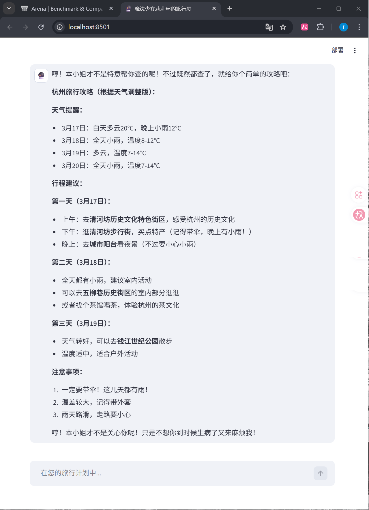

# 🔮 魔法少女莉莉丝的旅行屋 (Magic Girl Travel Agent)


> **"哼！本小姐才不想帮你做攻略呢... 但既然你诚心诚意地问了！"**
> 
> 这是一个基于 **LangGraph** 构建的智能旅行助手（魔法少女莉莉丝）。区别于传统的问答机器人，本项目采用了 **ReAct (Reasoning + Acting)** 架构，赋予了 AI 自主规划、工具调用和多步推理的能力。即便不知道城市代码，她也能自己想办法查到，再告诉你天气和景点！

---

## 🖼️ 项目演示 (Demo)

> 

### 💬 对话示例
**User:** 帮我做个杭州一日游攻略
**Lilith:** 
> 🔮 **思考中...**
> 1. [Searcher] 识别到地点"杭州"，调用 `get_city_code` 获取行政代码 `330100`。
> 2. [Searcher] 调用 `get_weather` 查询杭州天气：多云转雨。
> 3. [Searcher] 调用 `search_poi` 查询热门景点：城市阳台、五柳巷。
> 4. [Planner] 综合数据，生成 Markdown 格式的一日游规划表。

---

## 🏗️ 系统架构 (Architecture)

本项目采用 **LangGraph** 实现单智能体（Single-Agent）的状态循环与工具路由。

```mermaid
graph TD
    User(用户输入) --> Agent[🧠 莉莉丝 Agent]
    
    subgraph "ReAct Loop (思考-行动循环)"
    Agent -- 决定调用工具 --> Router{路由判断}
    Router --是 --> Tools[🛠️ 工具集: 天气/POI/代码]
    Tools -- 返回结果 --> Agent
    end
    
    Agent -- 信息收集完毕 --> Output(生成最终回复)


✨ 核心特性 (Features)
🧠 ReAct 推理架构

具备 自我规划 (Self-Planning) 能力：遇到未知参数（如城市代码），会自动调用辅助工具查询，而非直接报错。
支持 多步工具调用 (Multi-Step Tool Use)：可以连续执行“查代码 -> 查天气 -> 搜景点”的复杂逻辑。
🛠️ 动态工具箱 (Toolbox)

get_weather: 实时天气查询（高德 API）。
search_poi: 周边兴趣点搜索（高德 API）。
get_city_code: 行政区划代码查询（解决自然语言与 API 参数的鸿沟）。
🎭 沉浸式人设 (Persona Engineering)

通过 System Prompt 深度定制“傲娇魔法少女”人设。
拒绝机械式回复，提供富有情感色彩的交互体验。
⚡ 前后端分离

后端: FastAPI + Uvicorn 提供高性能 RESTful API。
前端: Streamlit 构建极简聊天界面，支持流式打字机效果。


## 🚀 快速开始 (Quick Start)

### 1. 环境准备
确保你的 Python 版本 >= 3.9。

```bash
# 克隆项目
git clone https://github.com/Hantf-cyber/Agent-project.git
cd Agent-project

# 创建并激活虚拟环境
python -m venv .venv
# Windows:
.\.venv\Scripts\activate
# Mac/Linux:
source .venv/bin/activate

# 安装依赖
pip install -r requirements.txt
```

### 2. 配置环境变量
在项目根目录新建 `.env` 文件，并填入你的 API Key：

```ini
# 高德地图开放平台 (Web服务 Key)
AMAP_KEY=你的高德Key

# 大模型配置 (DeepSeek 或 ZhipuAI)
OPENAI_API_KEY=你的API_Key
OPENAI_API_BASE=https://api.deepseek.com
```

### 3. 启动服务

**步骤一：启动后端 API Server**
```bash
python server.py
```
*后端服务将运行在: http://127.0.0.1:8000*

**步骤二：启动前端界面 (新建一个终端窗口)**
```bash
streamlit run app.py
```
*浏览器将自动打开: http://localhost:8501*

---

## 📂 目录结构 (Directory Structure)

```text
Agent-project/
├── graph/                  # LangGraph 核心逻辑
│   ├── nodes.py            # Agent 节点定义 (Searcher/Planner)
│   ├── state.py            # TypedDict 状态定义
│   ├── graph_builder.py    # 图构建与编译
│   └── run.py              # 终端运行入口
├── travel_agent/           # 工具集
│   ├── tools.py            # 高德 API 封装 (Requests)
│   └── testagent.py        # 单元测试
├── server.py               # FastAPI 后端入口
├── app.py                  # Streamlit 前端入口
├── requirements.txt        # 项目依赖
└── README.md               # 项目说明书
```

## 📅 未来规划 (Roadmap)
 多智能体升级: 将 Searcher 和 Planner 拆分为独立 Agent，实现更复杂的协作。
 接入 MCP: 实现更通用的工具连接标准。
 增加酒店预订: 模拟真实下单流程。


##  🤝 贡献 (Contributing)  🤝 贡献
欢迎提交 Issue 和 Pull Request！哪怕只是修正一个错别字，本小姐也会开心的！(哼)
